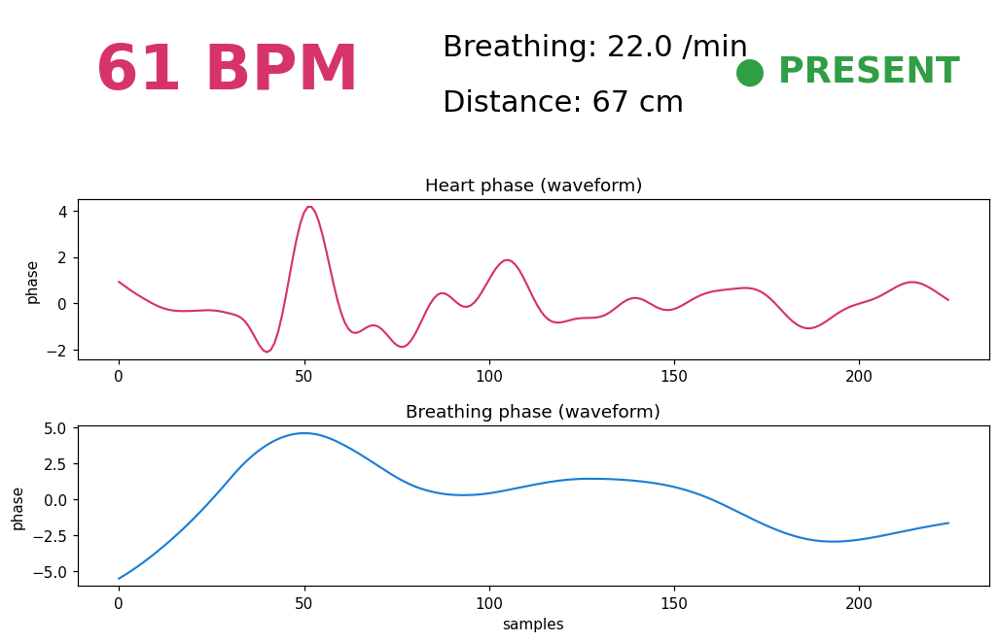

# ADTE2104 v2.0 — radar tętna i obecności (60 GHz)

Odczyt i wizualizacja na żywo z radaru **Andar ADTE2104 v2.0** (chip **ADT6101P**,
protokołowo zgodny z **HLK-LD6002**) podłączonego przez UART (mostek CP2104).

Dashboard pokazuje: **tętno [BPM]**, oddech [/min], dystans [cm], obecność oraz
przebiegi fazy sercowej i oddechowej.



## Dokumentacja

📖 **Online:** https://jakub-michalik.github.io/heartRate-adte2104-radar/
(budowana i publikowana automatycznie z `main` przez GitHub Actions →
[`.github/workflows/docs.yml`](.github/workflows/docs.yml))

Źródła w katalogu [`docs/`](docs/) — opis protokołu, instalacja, uruchomienie,
API i materiały. Budowanie lokalnie:

```bash
.venv/bin/pip install -r docs/requirements.txt
.venv/bin/sphinx-build -b html docs docs/_build/html
# otwórz docs/_build/html/index.html
```

## Protokół (zweryfikowany na żywo)

- **UART 1382400 baud, 8N1, bez parzystości.**
  ⚠️ `stty` / CP2104 nie ustawia tak wysokiego baudu — trzeba przez **pyserial**
  (`serial.Serial(port, 1382400)`), które ustawia go przez termios. Odczyt na
  460800 daje pozornie stabilne, ale **fałszywe** ramki (aliasing, 1382400 ÷ 3).
- Ramka TLV: `01 | ID(2 BE) | LEN(2 BE) | TYPE(2 BE) | HCK(1) | DATA[LEN] | DCK(1)`
  - `HCK = ~XOR(bajty 0..6) & 0xFF`, `DCK = ~XOR(DATA) & 0xFF`
  - wartości: **float32 little-endian**

| TYPE   | Znaczenie    | Payload                                  |
|--------|--------------|------------------------------------------|
| 0x0A13 | Phase        | 3× f32 (faza całkowita / oddechowa / serca) |
| 0x0A14 | Respiratory  | f32 — oddechy/min                        |
| 0x0A15 | **Heartbeat**| f32 — **BPM**                            |
| 0x0A16 | Distance     | u32 flaga + f32 [cm]; flaga==1 → obecność |

Firmware version **nie jest** wystawiana w strumieniu — appka identyfikuje moduł
i loguje ewentualne nieznane ramki.

## Instalacja

```bash
cd ~/repos/adte2104-radar
python3 -m venv .venv
.venv/bin/pip install -r requirements.txt
```

## Uruchomienie

```bash
cd ~/repos/adte2104-radar
.venv/bin/python adte2104_dashboard.py
```

Domyślny port to `/dev/ttyUSB1`. Inny port podajesz argumentem:

```bash
.venv/bin/python adte2104_dashboard.py /dev/ttyUSB0
```

Pewniejszy (stały) port niezależny od kolejności podłączania USB:

```bash
.venv/bin/python adte2104_dashboard.py \
  /dev/serial/by-id/usb-Silicon_Labs_CP2104_USB_to_UART_Bridge_Controller_02E22F5D-if00-port0
```

Zamknięcie okna lub `Ctrl-C` kończy program.

## Wymagania

- Linux, dostęp do portu szeregowego (bądź w grupie `dialout`, bez `sudo`).
- Środowisko graficzne (matplotlib otwiera okno GUI).

## Podłączenie

Moduł 3.3 V: `TX → RX` mostka, `RX → TX`, `GND → GND`.

## Źródła protokołu

- HLK-LD6002 (chip ADT6101P): <https://www.hlktech.net/index.php?id=1180>
- icewind1991/hlk_ld6002 (Rust): <https://github.com/icewind1991/hlk_ld6002>
- phuongnamzz/HLK-LD6002 (Arduino): <https://github.com/phuongnamzz/HLK-LD6002>
